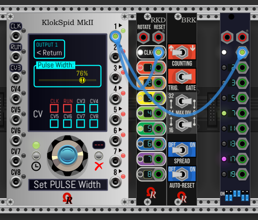

# Ohmer Modules for VCV Rack 2 (Open Source)

------
## KlokSpid

This module is removed (it was as *deprecated* status since... two years!), this module is replaced by the more powerful **KlokSpid MkII**, from [OhmerPrems plugin](https://github.com/DomiKamu/OhmerPrems).
Despite OhmerPrems is a commercial plugin (for some modules), **KlokSpid MkII** is absolutely free to everyone, it works without any limitation!

------
## RKD (Rotate Klok Divider) and BRK (expander)

**RKD (Rotate Klok Divider)**, inspired by [4ms Company](https://4mscompany.com/) **RCD** module (with 4ms Company restrictive permission).

**BRK**, inspired by 4ms Company **RCDBO** module (with 4ms Company restrictive permission), as RKD expander.

**BRK** is basically an additional panel (4 HP, must be placed alongside RKD) providing six deported switches. By this way, it's more comfortable to change module's settings "on-the-fly", without need to access PCB to change jumpers. When RKD module was set correctly, you'll can remove its BRK expander.

Please take a look on [RKD / RKD with "Break" User's Manual (PDF)](docs/modules/RKD/Manual.pdf).

Please notice both RKD and BRK modules support **Use dark panels if available** feature (from **View** menu) since VCV Rack v2.4.0. Depending the setting, the panels are dark or light, automatically.

------
## Metriks

**Metriks**, a 8 HP metering module, for now providing **voltmeter** and **CV tuner** modes only (please notice other modes, such *BPM Meter*, *Frequency Counter* and *Peak Counter* are temporary disabled, like a "scrolling message" says on the dot-matrix display when you select one of these unavailable modes). 

[Metriks - Quick Guide **is here!**](docs/modules/Metriks/Manual.md) please notice **Metriks module remains in development!**.

------
## Polarity Switch

**Polarity Switch**, a dual module will route incoming voltage on **IN** jack to **P** output jack if the incoming voltage is positive, or to **N** output jack (as absolute value) if the incoming voltage is negative.

Voltage applied on **IN** jack may be kept 'as is' (default behavior), or converted/forced to +5V or +10V - option via ual menu, per module part (upper and lower parts are totally independent, like "two modules in one"). **Please consider all outputted voltages are always positive, even on N jacks!**

Like Metriks, this module is also available all six models (**Model**, from contextual menu).
It supports both monophonic or polyphonic cables.

Example by using bipolar LFO sine on input (provided by *former* KlokSpid, sine LFO on jack #4):

Polarity Switch against polyphony (using lower part of module only):

**NOTE:** as upper and lower parts are totally independent (like "two modules in one"), both module parts may have different polyphony settings.

Since VCV Rack v2.4.0, depending **Use dark panels if available** option (from **View** menu) is enabled or not, the presented model from module browser (and the model added as new module in your rack) may be *Absolute Night* (as default dark panel, when enabled) or *Creamy* (as default light panel). When added on your rack, the model doesn't change (even if you change **Use dark panels if available** setting) until you select another one from contextual menu.

------
## Splitter 1x9

**Splitter 1x9**, a simple "multi" 1-input to 9-outputs. Like Metriks, this module is also available all six models (**Model**, from contextual menu).
It supports both monophonic or polyphonic cables.

------
## Blank panels

**Set of blank panels** (without logo) to fill any holes in your rack: 1 HP, 2 HP, 4 HP, 8 HP, 16 HP and 32 HP. Like Metriks, Polarity Switch, and Splitter 1x9, **these "blank" panels have six "models" too**!

Please notice the 2 HP blank panel have an extra contextual menu, in order to customize **screws disposal**:

Depending **Use dark panels if available** option (from **View** menu) is enabled or not, the presented model from module browser (and the model added as new module in your rack) may be *Absolute Night* (as default dark panel, when enabled) or *Creamy* (as default light panel). When added on your rack, the model doesn't change (even if you change **Use dark panels if available** setting, later), until you'll select another one from contextual menu.

------
## Releases

Releases for Windows, MacOS (Intel), MacOS (ARM64) and Linux platforms are available either from VCV Rack 2 [Plugin Library](https://vcvrack.com/plugins.html), and from [my GitHub "releases" page](https://github.com/DomiKamu/Ohmer/releases) (each platform have its .vcvplugin file).

**Current release**: v2.6.11 (February 28th, 2026), compatible vs. Rack SDK v2.6.6:

------
## License Clauses

All Ohmer modules are free, source code is provided.

Source code is licensed under **BSD 3-Clause**, by Dominique Camus. Graphic materials can't be used for derivative works without my (written) permission, and can't be altered.

About RKD modules: the [4ms Company](https://4mscompany.com/) doesn't endorse any support or responsibility about this conversion for VCV Rack, **anyway**! These modules follow guidelines given by 4ms Company, including respect of non-usage of company logo, brand name (4ms), and trademarked modules names (RCD, Rotating Clock Divider, RCDBO, and RCD Breakout). Both **RKD** and **BRK** modules use exclusively 100% homemade C++ open-source code, have many variations regarding some graphical and technical specifications, and provide additional features, such different colors on panels, and segment-LED displays (instead of silkscreen prints) showing dividers for every output jack, in real-time.

Feature requests, suggestions, and bug reports are welcome on [GitHub repository](https://github.com/DomiKamu/Ohmer-Modules/issues).

------
## Thanks to:

- **Andrew Belt** (and development team) for his fantastic VCV Rack software, now in v2!
- **Xavier Belmont** for his fantastic work around SVG graphics (silver/gold connectors and buttons).
- **Marc Boulé** for C++ tips (in particular about C++ code to swap SVG graphics for input & output ports).
- **Dale Johnson** (author of Valley's *Topograph* & *Dexter* modules), for GUI-change on the fly and *framing*.
- **Michael Struggl** , for similar suggestion (about Audible Instruments' Tidal, using similar feature).
- **Gerhard Brandt**, about Prime numbers & Fibonacci tables for RKD module.
- 4ms Company, for their (conditional) permission about their RCD / RCDBO modules conversion.
- **Builders** for MacOS & Linux (particular mention to **Jens Peter Nielsen**, **Clément Foulc**, **Steve Baker** and **Marc Boulé** for MacOS builds, also  to **Zulu Echo Romeo-Oscar** for Linux builds).
- Many enthusiast users!
- Generous contributors, coding tips & optimizations, enhancements, and features ideas!
- The most important: our existing (and growing every day) communities around VCV Rack!

------
## Who am I?

My name is Dominique CAMUS, 62-years old French guy, my job is networks and systems admin (but retired). I'm living now in south of France, near Nîmes (Gard - 30). Mine hobbies are mainly C.M. experimentations (as curious guy I am), playing keyboard (live performance at home, in my living room, using Native Instruments KOMPLETE KONTROL S61 MK2 keyboard, and Arturia BeatStep Pro controller), flight simulation (Prepar3D v5, flying mainly airliners such Airbus A319/A320, Boeing 737-800, Boeing 777-200/-300), Kerbal Space Program, Elite: Dangerous Horizons, videogame emulators (for sure, I'm a nostalgic guy) such M.A.M.E, pinball games (Visual Pinball X), infiltration games (HITMAN WoA franchise, Sniper Ghost Warrior), homemade developments, friends, family, swimming pool, my lovely village...

### Enjoy Ohmer modules!
