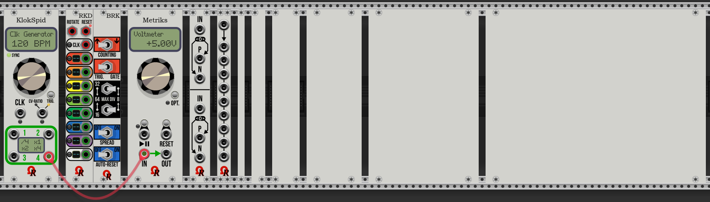
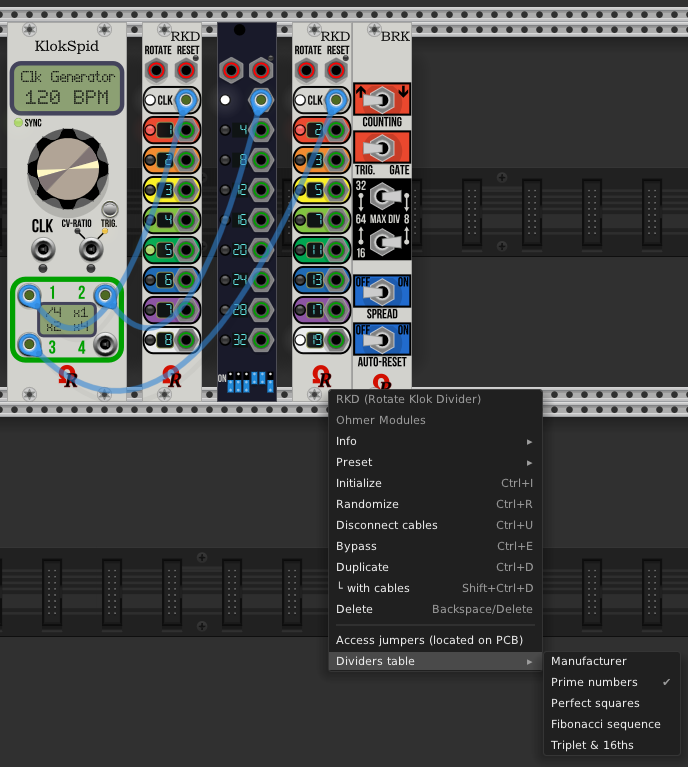

# Ohmer Modules for VCV Rack

### ***MANUALS:***

[RKD / RKD with "Break" User's Guide (PDF)](res/Manuals/RKD%20User's%20Manual.pdf) (still under construction and... delayed sorry!).

[Metriks - Quick User's Guide](doc/Metriks.md) (module still in development, thanks for your patience!)

------

Flagship of *Ohmer Modules* plugin is **KlokSpid** (pronunciation of "clock speed"), a modern "CPU-controlled"-style clocking module, designed for any rack requiring BPM-based clock sources and/or clock modulators (clock multipliers and dividers).

Available as six models (aka... GUI themes), can be changed anytime you want, from context-menu (right-click menu).

**Classic** (default beige), **Stage Repro** and **Absolute Night** models embed LCD dot-matrix displays (DMD) and silver parts (button, screws and jacks). The Absolute Night model embeds a yellow-backlit LCD DMD, however.

**Dark "Signature"**, **Deepblue "Signature"** and **Carbon "Signature"** models embed a plasma-gas dot-matrix displays, and luxury golden button, screws, and jacks, instead.

Basically, KlokSpid module provides two modes:

- **Standalone BPM-clock generator**, covering all possible BPM from 1 to... 960 (beats), selectable only by encoder (no CV). The small button (at the right side of module) may be used as toggle, to start or stop BPM clocking (current state is reflected by "SYNC" LED: green while running, red when stopped). However, each output jack may receives a predefined clock ratio, and jack #4 (when set at x1) may delivers LFO waveform (based on displayed BPM).
- **Clock modulator** (sometimes designed as *clock multiplier or divider*) covers a lot of predefined ratios (or rates), from 1 to 10 (all), 12, 15, 16, 24, 32 and 64, when the ratio (rate) is set manually (via encoder). However, the ratio is ***voltage-controllable*** (thanks to **CV-RATIO/TRIG.** input jack) to reach any multiplier or divider value you'd like, including "exotic" ratios (like x37 or /59), from 1 to 64.

Clocking mode is automatically selected by an internal sensor (and module's firmware), in fact, depending the **CLK** input jack is connected, or not.

If connected (patched), KlokSpid module works as ***clock modulator*** (multiplier or divider), otherwise, it works as standalone BPM-based ***clock generator***.

As clock modulator, generated signals are always sent to **four identical** outputs (like a "1x4" multi), to avoid splitter/multiples usage behind module (or multiples patch cables connected on the same jack).

However, while KlokSpid works as clock generator, several options (determinable via module's SETUP) permits to select a specific multiplier or divider for any output jack, and output a specific LFO waveform to output jack #4 such sine, inverted sine, triangle, inverted triangle, sawtooth or inverted sawtooth (sometimes called *down sawtooth*). From module's SETUP, this feature is **Out. #4 LFO**. (disabled by default), but can be enabled only if jack #4 ratio is set as "x1" (ratio take priority over LFO).

Voltages sent to all outputs is, by default, defined to **+5V**, but, in case you'll need another voltage, it can be changed to either **+2V**,  **+10V**, or **+11.7V**.

Output signal duration is mainly *gate-based*, by default as **Square** waveform (aka gate 50%) of BPM pulse, if working as standalone BPM-clock generator, or current multiplied/divided frequency (as soon as the source frequency is stable / established by the module - indicated by SYNC" LED - green means source frequency is stable). This factory setting covers major usages about a clocking device, but of course, other duration can be selected, in fact depending your needs (e.g.: to control longer sustains for ADSR envelope generators, to hold longer playing sample, etc.). Shortest durations are mostly designed to control a sequencer or to trigger a drum module.

The right-side input jack labeled both **CV-RATIO** and **TRIG.** is versatile: when KlokSpid module is working as clock multiplier/divider, this jack can accept CV to control clocking ratio (any integer value from /64 to x64), via **-5V/+5V bipolar** voltage (default), or optionally 0V/+10V unipolar. At the other side, when KlokSpid module is working as standalone BPM-clock generator, this jack becomes a "trigger" input, and provides, in this case, one of these features:

- as BPM-reset (most common usage) to keep separate KlokSpid modules, as clock generators, perfectly synchronized (default) between each other. Also all waveforms generated by KlokSpid become "in phase" after a reset. Obviously, all related BPM-clock generators must have exactly the same BPM!
- to toggle BPM "start/stop" state, exactly like a "remote" does (optional, can be defined via SETUP).

<u>**TIP:**</u> two small orange LEDs belong this jack reflect, when lit, the current jack role: CV-RATIO, or TRIG.

Please note both **CLK** and **TRIG.** input jacks will trigger at +1.7V (or above), on rising edge. Low voltage for "retrigger" is +0.2V (or below), on falling edge.

One of interesting feature offered by KlokSpid module is an embedded SETUP program (like personal computer does), in order to customize some settings. To enter the module's SETUP mode, simply **press and hold** the small button for approx. 2 seconds, until the message **- SETUP -** is displayed, confirming the module's SETUP now is running. Press the button (like indicated) to go to first setting: *CV Polarity*.

Setting's name is displayed on first line, and its current value on second line.

During SETUP operation, you'll can notice the module continues to work, except you can't alter, via encoder, the current ratio / current BPM, because the encoder becomes... the value selector (to select next or previous value, for current displayed setting, simply turn the knob clockwise or counter-clockwise). Any setting you're currently editing is reflected, in real-time, by the module, it may be useful, for example, to experiment different output durations, voltages, CV polarity, LFO on jack #4 behaviors...

To advance to next setting, just press the button.

Note: as long as you don't touch the encoder, the current value (for related parameter) remains unaffected.

The last setting is SETUP-exit "human decision" (you'll can use encoder to change, then press button):

- **Save/Exit**: all changes made during SETUP operation are saved (this option is always default).
- **Canc./Exit**: settings prior entered SETUP are fully restored (meaning all changes made are ignored).
- **Review...**: return to first setting (CV Polarity) and browse all settings again!
- **Factory**: restore initial settings (same as fresh module mounted in rack), aka "reset to factory".

**<u>TIP:</u>** while SETUP is running, **long press/hold** on button does an **immediate** "Save/Exit", it's a kind of "shortcut", or quick way to quit SETUP, as soon as you consider the current settings are fine, useful to avoid browsing all remaining settings until SETUP-exit decision!

Obviously, all settings you've defined via SETUP are automatically saved along your ".vcv" patch file (including "autosave.vcv"). Also, all current settings are transferred "on-the-fly" when you duplicate (clone) the module, even during SETUP operation (in this situation, new clone isn't running SETUP mode, however, because cloning assumes an "automatic Save/Exit" for its clone!)

#### **All Ohmer Modules:**

**RKD (Rotate Klok Divider)**, inspired by [4ms Company](https://4mscompany.com/) **RCD** module (with limited permission).

**RKD with "Break"**, its _big Brother_, inspired by 4ms Company **RCDBO** module (with limited permission).

**RKD with "Break"** is mainly a (4 HP) RKD module, and an additional panel (4 HP too, alongside RKD) providing six deported switches. By this way, it's more comfortable to change module's settings "on-the-fly", without need to access PCB to change jumpers. ***Both modules provide exactly the same features!***

IMPORTANT: replacing this complete module by a 4 HP **BRK expander** (left or right side) of RKD module, is under consideration (but not confirmed). Unfortunately, expanders are new Rack 1 feature, but still undocumented for developers. Also, this fact may cause additional delays concerning... the PDF manual!

Please take a look on [PDF user's manual](res/Manuals/RKD%20User's%20Manual.pdf) _(still under construction, but useful to start however)_.

**Metriks**, a 8 HP measurement/visual module: **voltmeter** and **CV tuner** (other modes such Frequency Counter, BPM Meter and Peak Counter, are temporary disabled, like a "scrolling message" says on the dot-matrix display, as long as they remain in development). 

[Metriks - Quick Guide](doc/Metriks.md) here! please notice **this module still in development**, thanks for patience. Next mode will be implemented is... BPM Meter.

**Splitter 1x9**, a simple "multi" 1-input to 9-outputs. Like KlokSpid and Metriks, this module is also available... all six models (from context-menu). This module supports both monophonic or polyphonic cables.

**Set of blank panels** (without logo yet) to fill any holes in your rack: 1 HP, 2 HP, 4 HP, 8 HP, 16 HP and 32 HP. Like KlokSpid, Metriks, and (_introduced in v1.0.0_) Splitter 1x9, **now these "blank" panels have six models too**! Please notice the 2 HP blank panel have an extra context-menu, in order to change **screws disposal**:

## Releases

Releases for Windows, MacOS and Linux platforms are available either from VCV Rack [Plugin Library](https://vcvrack.com/plugins.html) page, and/or from [my GitHub "releases" page](https://github.com/DomiKamu/Ohmer-Modules/releases) (zip file - once per platform, manual installation).

## License Clauses

All Ohmer Modules are free, source code is provided.

Source code is licensed under **BSD 3-Clause**, by Dominique Camus. Some graphic materials can't be used for derivative works without my permission.

About RKD modules: the [4ms Company](https://4mscompany.com/) doesn't endorse any support or responsability about this conversion for VCV Rack, **anyway**! These modules follow guidelines given by 4ms Company, including respect of non-usage of company logo, brand name (4ms), and trademarked modules names (RCD, Rotating Clock Divider, RCDBO, and RCD Breakout). Both **RKD** and **RKD with "Break"** modules use exclusively 100% homemade C++ code (provided), have some variations regardling some graphicals and technical specifications, and provide additional features, such different panel colors, and segment-LED displays (instead of silkscreen prints) showing dividers for every output jack, in real-time.

Feature requests, suggestions, and bug reports are welcome on [GitHub repository](https://github.com/DomiKamu/Ohmer-Modules/issues).

### Current release: v1.1.2 (July 21st, 2019):

- Bugfixes and enhancements are described in details into [CHANGELOG.TXT](doc/CHANGELOG.txt).

### Thanks to:

- **Andrew Belt** (and development team) for his fantastic VCV Rack software.
- **Xavier Belmont** for his fantastic work around SVG graphics (silver/gold connectors and buttons).
- **Marc Boulé** for C++ tips (in particular about C++ code to swap SVG graphics for input & output ports).
- **Artur Karlov** about KlokSpid source code merge tip (source maintenance is more easy, BTW).
- **Dale Johnson** (author of Valley's *Topograph* & *Dexter* modules), for GUI-change on the fly and *framing*.
- **Michael Struggl** , for similar suggestion (about Audible Instruments' Tidal, using similar feature).
- **Gerhard Brandt**, about Prime numbers & Fibonacci tables for RKD / RKD+BRK modules.
- 4ms Company, for their (conditional) permission about their RCD / RCDBO modules conversion.
- **Builders** for MacOS & Linux (particular mention to **Clément Foulc** for MacOS builds, and to **Zulu Echo Romeo-Oscar** for Linux builds).
- Many enthusiast users!
- Generous contributors, coding tips & optimizations, enhancements and features ideas!
- The most important: our existing (and growing every day) communities around VCV Rack!

### Who am I?

My name is Dominique CAMUS, 55 years old French guy, my job is networks and systems administrator (but actually, I'm working for association every morning). I'm living near [Chartres](https://en.wikipedia.org/wiki/Chartres) (world-famous about its wonderful cathedral), city located 90 km southwest of Paris, France. Mine hobbies are mainly C.M. experimentations (as curious guy I am), playing keyboard (only live performance at home, in my living room, using M-Audio CODE61 MIDI controller and sometimes, Liine Lemur on iPad 3), flight simulation (Prepar3D v4, flying mainly airliners such Airbus A319/A320 and Boeing 737 NG), Kerbal Space Program, Elite: Dangerous Horizons, videogame emulators (for sure, I'm a nostalgic guy) such M.A.M.E, pinball games, infiltration games (Metal Gear, Splinter Cell), homemade developments, friends, my girlfriend (ton of kisses), swimming pool, my city...

### Enjoy Ohmer Modules!
