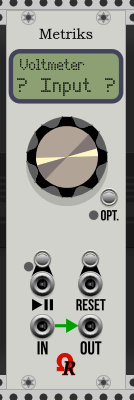
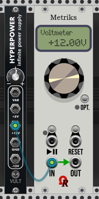
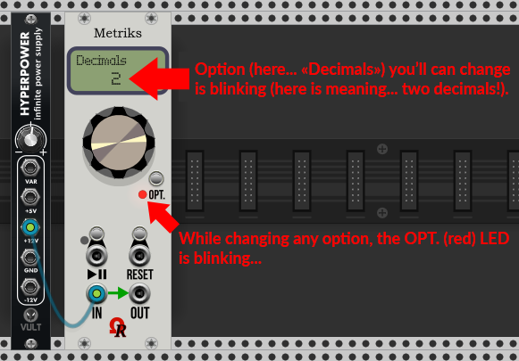
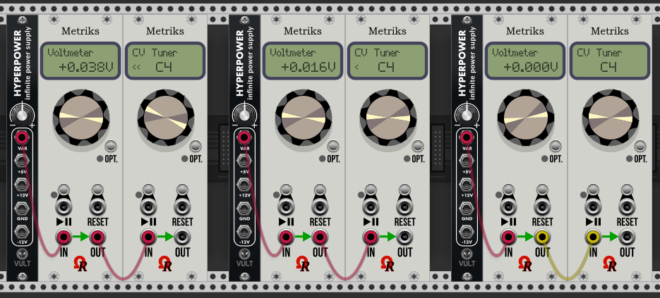

# Ohmer Modules - Metriks

#### **INTRODUCTION**

***Metriks*** is a 8 HP *CPU-controlled* metering/visual module, designed for VCV Rack: for now, two features are fully available: **Voltmeter** and **CV Tuner** .

Please notice other features (aka "modes") such **BPM Meter**, **Peak Counter** and (simple) **Frequency Counter**, are actually disabled, as long as these modes still in development. Thanks for patience!

#### **MODULE LAYOUT**

Like other Ohmer Modules / OhmerPrems (except RKD), Metriks exists in six models (variations), shown above.

These are **Classic** (default beige), **Stage Repro**, **Absolute Night**, **Dark "Signature"**, Deepblue "Signature" and **Carbon "Signature"**. The model can be changed via context-menu.

First three models (non-Signature line) use cheap silver metal jacks, buttons and screws, and embed a black LCD dot-matrix display (DMD). However, *Absolute Night* model uses a yellow-backlit DMD.

Last three models (*Signature* line) use *expensive* gold jacks, buttons and screws, and embed a plasma-gas dot-matrix display (DMD) instead.

Below the dot-matrix display (DMD), the knob is in fact a **continuous encoder** (doesn't have min./max. limits). Its main goal is to select next mode (when turned clockwise) or previous mode (when turned counter-clockwise). Also, as will be explained later, the encoder is used to select next or previous possible parameter while you're changing an option (for current mode).

At bottom-right side of encoder, you can find **OPT.** button, and its related LED (unlit, or red). This button is useful to change some option(s) for current mode.

Just below, the PLAY/PAUSE and RESET buttons and jacks, are actually unused (but will be used for incoming *Peak Counter* mode).

At the bottom of module, the **IN** jack is... the input, used for signal metering.

The **OUT** jack is a "replica" of INput jack: it's useful to insert one (or many) Metriks module(s) in chain, like image above.

#### **QUICK USAGE GUIDE**

When you bring a Metriks module, by drag-and-drop from Rack's modules browser, the module is:

- Model: Classic (can be changed from context-menu aka *right mouse click* menu).
- Mode: Voltmeter (will display voltages applied on **IN** jack, realtime (but updated only when changed), always using +/- sign, two decimals by default). TIP: the top line on DMD always indicates the current mode (e.g. Voltmeter in this case).
- Display blinking **? Input ?** as long as **IN** jack isn't connected on voltage source:

As soon as you connect a voltage source, voltage is displayed, like this:

Now it's time to change some options (for current mode, in this case for... voltmeter).

In fact, **"Voltmeter" mode have only one option**: the number of displayed decimals. To change this option, simply press the **OPT.** button: now its (red) LED blinks, and the option you'll can change also blinks at the bottom of DMD... For Decimals, you'll can choose 0 to 3 (default is 2):

While blinking, just turn the continuous encoder...

- Clockwise, to select next possible parameter (or to increase the display value).
- Counter-clockwise to select previous possible parameter (or to decrease the displayed value).

When done, press the OPT. button again to reach next option (if available), or to return to production (LED is turned off). Also, when blinking, if you don't touch either the continuous encoder / button, a 10-seconds timeout will automatically return to production.

Of course, voltmeter mode provides only one option (the number of displayed decimals), however some other modes may have more options (for example, the **CV Tuner** mode have two options: the notation, and sharps/flats). Future **BPM Meter** mode doesn't have option, in this case, using the OPT. button doesn't have any effect.

#### **THE CV TUNER MODE**

CV Tuner is a new mode (introduced since Ohmer Modules v1.1.2) who display a note-equivalent regardling **constant voltage** applied on IN jack. This may useful, for example, to fine tune a CV sequencer, or similar!

From Voltmeter, just turn the encoder clockwise, in order to select CV Tuner (as next mode).

Like any mode, **CV Tuner** must be display on the top of the DMD.

The CV Tuner is calibrated on **A4** (**La4**) at **440Hz** (often named *A440*), as **reference pitch**.

IMPORTANT: supported range for CV Tuner is from **C-1** (**Do-1**) at **-5V**, upto **B9** (**Si9**) at **+5.917V**. Otherwise a question mark "'?" will be displayed as out of range.

This mode provides two options:

- Notation: may be standard English **C D E... B** notation (default), or latin **Do Re Mi... Si** notation.
- Sharps/Flats: using sharp (#) - default - or flat (b) note name, if you prefer.

Press OPT. button once to change notation, then press OPT. again to change sharps/flats. Third press will return to production (all bink stop, LED is turned off).

The **<<** / **<** / **>** or **>>** indicator alonside note name:

- Two indicators (**<<** or **>>**) means **coarse tuning** is required. Left **<<** means the note is far below: in this case, decrease the voltage (from voltage source). On the same way, right **>>** means the note is far above, in this case, increase the voltage (see left configuration, image below).
- One indicator (**<** or **>**) means **fine tuning** is required (left **<** is meaning the note is a bit below, just **decrease the voltage a bit** (from voltage source). On the same principle, right **>** means the note is a bit above, in this case, **increase the voltage a bit** (see middle configuration, image below).
- When the voltage is perfect, no symbol are displayed: you've found the correct voltage for desired note! (see right configuration below).

