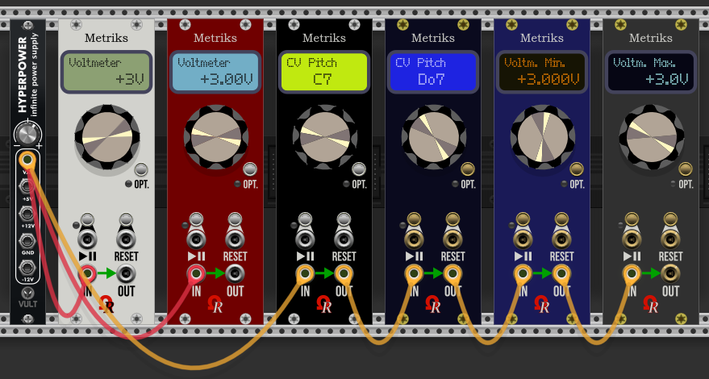
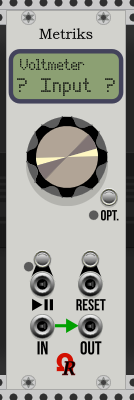
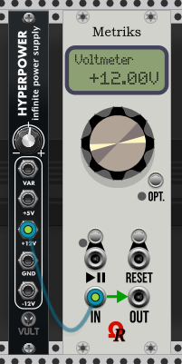
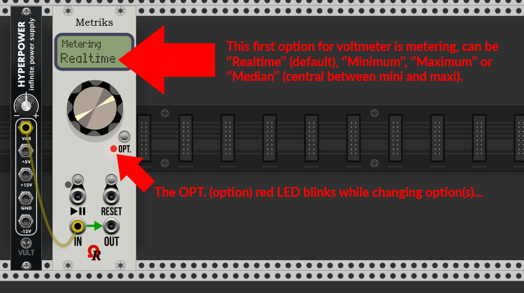
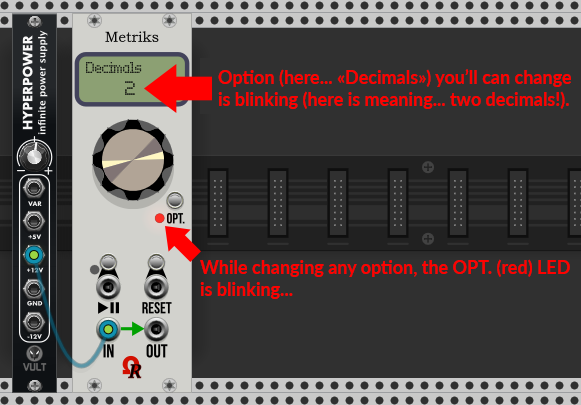
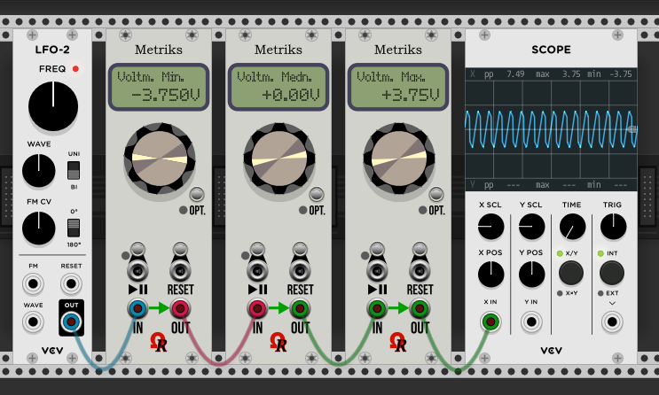

# Ohmer Modules - Metriks

#### **INTRODUCTION**

***Metriks*** is a 8 HP *CPU-controlled* metering/visual module, designed for VCV Rack: for now, two features are fully operational: **Voltmeter** and **CV Pitch**.

Please notice other features (aka "modes") such **BPM Meter** and **Peak Counter** are actually disabled (must be entirely reworked), as long as these modes still in development. Thanks for patience!
Also, **Frequency Counter** mode will be abandoned.

#### **MODULE LAYOUT**

Like other Ohmer Modules (except RKD and his BRK modules), Metriks exists in six models (theme variations), shown above.

These are **Creamy**, **Stage Repro**, **Absolute Night**, **Dark "Signature"**, **Deepblue "Signature"** and **Titanium "Signature"**. You'll can select any model you'll want, via contextual menu.

First three models (non-Signature line) use "cheap" silver metal jacks, buttons and screws, and embed a black LCD dot-matrix display (DMD). However, *Absolute Night* model uses a yellow-backlit DMD as retrofit.

Last three models (*Signature* line) use *expensive* golden jacks, buttons and screws, and embed a plasma-gas dot-matrix display (DMD), instead.

Below the dot-matrix display (DMD), this is the **continuous encoder** (unlike knob, it doesn't have min./max. limits). Its main goal is to select next mode (when turned clockwise) or previous mode (when turned counter-clockwise). Also, as will be explained later, the continous encoder is used to select next or previous possible parameter while you're changing an option, for current mode.

At rightmost side of the module, this is the **OPT.** (option) button, and its related LED (may be unlit, or red). This button is useful to change some options for current mode.

Just below, the PLAY/PAUSE and RESET buttons, and jacks (but actually unused - they will be used for future reworked *Peak Counter* mode).

At the bottom of module, the **IN** jack is... the input, used for signal to be measured.

The **OUT** jack is a "replica" of INput jack: it's useful to insert one (or many) module(s) as daisy-chain.

#### **QUICK USAGE GUIDE / THE VOLTMETER MODE**

When you bring a new instance of Metriks module (from Rack's modules browser), the module is:

- Model: Creamy (can be changed from contextual menu - aka *right-mouse click* over module menu, list from **Model** menu item).
- Mode: Voltmeter (it displays voltage applied on **IN** jack, realtime, always using +/- sign, decimals set to **Auto** by default). TIP: the top line on DMD always indicates the current mode (e.g. "Voltmeter" in this case).
- Display blinking **? Input ?** as long as **IN** jack remains disconnected:

As soon as you connect **IN** jack to a source voltage, voltage is displayed like this:

Now it's time to change some options (for current mode, in this case for voltmeter).

Voltmeter have two options:

- The **Metering** behavior (choices between **Realtime** for realtime voltage measurements, **Minimum** registers the minimum voltage, **Maximum** registers the maximum voltage, and **Median** a median between max. and min. registered voltages).
- The number of displayed decimals, may be **Auto** (the module selects how many decimals it can display), and **0** to **3** in case you'll want always a specific number of displayed decimals.

In order to change options, simply press the **OPT.** button: now the red LED is blinking, and the first option you'll can edit is blinking too at the bottom of the DMD... for voltmeter, the first option is "Metering":

While **OPT.** LED (and bottom line on DMD) is blinking, just rotate the continuous encoder:

- Clockwise, to select next possible choice for the option.
- Counter-clockwise to select previous possible choice.

Now, by pressing OPT. button once again, the second option, number of decimals, can be changed if you want.

For *Decimals*, you'll can choose either from "0" to "3", or "Auto" (default is "Auto"), by rotating the continous encoder:

When done, press the OPT. button to exit options and return to production (because it was the last option). The **OPT** LED is off.

Also, when blinking, if you don't touch either the continuous encoder or **OPT** button, a 10-seconds timeout will automatically return to production.

When voltmeter is set for **Min.**, **Max.** or **Medn.** (median), the **RESET** button (and/or its trigger jack) will clear (return to 0) all minimum, maximum (and median) previously registered voltages.

Some modes provides only one option (the future Peak Counter, to choose threshold voltage only), some other modes have two options (for example, the **Voltmeter** and the **CV Pitch**). Future **BPM Meter** mode doesn't provide any option, in this case, the OPT. button remains inoperative.

#### **THE CV PITCH MODE**

Previously named "CV Tuner" (but replaced by more explicit "CV Pitch") is a mode introduced since Ohmer Modules v1.1.2. It displays a note-equivalent, regardling **constant voltage**, as pitch (based on Volt per octave) applied on **IN** jack. This mode may help you to tweak a CV-based sequencer (as example - to save possible usage of quantizer module).

From **Voltmeter** mode, just rotate the continous encoder clockwise, in order to select **CV Pitch** (as next mode).

Like any mode, **CV Pitch** must be display on the top of the DMD.

The CV Pitch is mainly calibrated on **A4** (**La4**) at **440Hz** (often named *A440*), as **reference pitch**.

IMPORTANT: supported voltage range is from **C-1** (**Do-1**) at **-5V**, upto **B9** (**Si9**) at **+5.917V**. Otherwise a question mark "'?" will be displayed as "out of range".

This mode provides two options:

- Notation: may be standard English **C D E... B** notation (default), or latin **Do Re Mi... Si** notation.
- Sharps/Flats: using sharp (#) - default - or flat (b) note name, if you prefer.

Press **OPT.** button once to change notation, then press it again to change sharps/flats. Third press will return to production (no more blinking, **OPT.** LED is off).

The **<<** / **<** / **>** or **>>** indicator alongside the displayed note name/octave:

- Two indicators (**<<** or **>>**) means **coarse tuning** is required. Left **<<** means the note is far "below": in this case, decrease the voltage (from voltage source). On the same way, right **>>** means the note is far "above", in this case, increase the voltage to reach the voltage corresponding to the displayed note.
- One indicator (**<** or **>**) means **fine tuning** is required (left **<** is meaning the note is a bit "below", just **decrease the voltage a bit** (from voltage source). On the same way, right **>** means the note is a bit "above", in this case, **increase the voltage a bit** to reach the voltage corresponding to the displayed note.
- When the voltage is perfect, "direction" indicators disappear, you've found the precise voltage for desired note!
